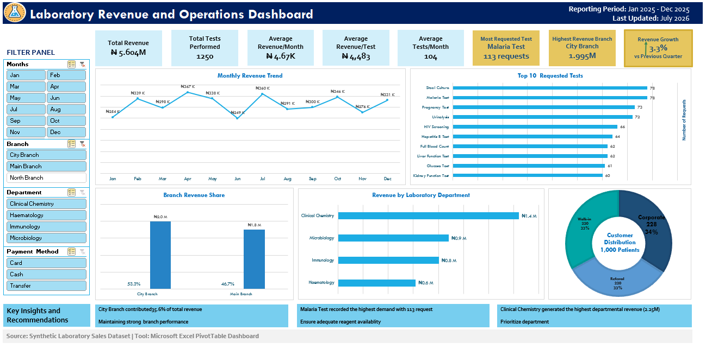

# Laboratory Revenue and Operations Dashboard 📊🧪

------------------------------------------------------------------------


------------------------------------------------------------------------

## Project Overview

This project presents an interactive **Laboratory Revenue and Operations Dashboard**
developed using **Microsoft Excel PivotTables**, **PivotCharts**, **Slicers**, and 
**KPI cards** to analyze laboratory revenue and operational performance.

The dashboard analyzes laboratory sales and operational data to provide
insights into revenue performance, test demand, branch performance,
departmental contribution, and customer distribution.

The goal of this project is to demonstrate how healthcare laboratory
data can be transformed into meaningful business insights that support
data-driven decision-making.

------------------------------------------------------------------------

## Dashboard Analysis

The interactive dashboard provides insights into laboratory revenue 
performance, test demand, branch contribution, and customer distribution.

 

------------------------------------------------------------------------

## Business Problem

Healthcare laboratories generate large volumes of operational and
financial data. This project analyzes:

-   Highest revenue-generating branches
-   Departmental revenue contribution
-   Most requested laboratory tests
-   Revenue trends over time
-   Patient distribution patterns

------------------------------------------------------------------------

## Dataset Description

The dataset is a synthetic laboratory sales dataset containing **1,000
laboratory transaction records** created for analytics practice.

Features include:

  Column           Description
  ---------------- ------------------------------------
  Transaction_ID   Unique transaction identifier
  Patient_ID       Unique patient identifier
  Age              Patient age
  Gender           Patient gender
  Patient_Type     Walk-in, Referral, Corporate
  Test_Date        Date laboratory test was performed
  Test_Category    Laboratory department/category
  Test_Name        Laboratory investigation name
  Test_Result      Test result information
  Branch           Laboratory branch location
  Payment_Method   Payment channel
  Revenue          Revenue generated from test

------------------------------------------------------------------------

## Tools Used

-   Microsoft Excel
-   PivotTables
-   PivotCharts
-   Slicers
-   KPI Cards
-   Data Visualization
-   Dashboard Design

------------------------------------------------------------------------

## Project Methodology

1.  Data Preparation
    -   Generated synthetic laboratory transaction data.
2.  Data Cleaning
    -   Checked data consistency, missing values, and formatting.
3.  Data Analysis
    -   Created PivotTables and calculated performance metrics.
4.  Dashboard Development
    -   Designed an interactive dashboard using KPI cards, charts, and
        slicers.
5.  Insight Generation
    -   Identified trends to support decision-making.

------------------------------------------------------------------------

## SQL Analysis

SQL was used to analyse the laboratory sales dataset and extract meaningful 
business insights related to revenue performance, diagnostic test demand,
and operational trends.

### SQL Objectives

The analysis aimed to answer key business questions:

- What is the total revenue generated from laboratory transactions?
- How many laboratory tests were performed?
- Which diagnostic tests are most frequently requested?
- Which tests generate the highest revenue?
- What is the average revenue per test?
- Which laboratory branches contribute the most revenue?
- How does revenue change monthly?

### SQL Queries Performed

The following analyses were performed using MySQL:

1. **Total Revenue Analysis**
   - Calculated the overall revenue generated from laboratory transactions.

2. **Test Volume Analysis**
   - Counted the total number of laboratory tests performed.
   - Identified the most requested diagnostic tests.

3. **Revenue Performance Analysis**
   - Ranked diagnostic tests based on revenue contribution.
   - Identified the highest revenue-generating tests.

4. **Average Revenue Analysis**
   - Calculated the average revenue generated per laboratory test.

5. **Branch Performance Analysis**
   - Evaluated revenue contribution across laboratory branches.

6. **Monthly Revenue Trend Analysis**
   - Analysed revenue patterns over time to identify trends.

### Key SQL Insights

- Generated a total revenue of NGN 5.6M from laboratory transactions.
- Identified high-demand diagnostic tests based on test frequency.
- Determined diagnostic tests contributing the highest revenue.
- Evaluated branch revenue performance and monthly revenue patterns.

### SQL Script

The complete SQL queries used for this analysis are available here:

[View SQL Queries](SQL/Laboratory_Sales_Analysis.sql) 
------------------------------------------------------------------------

## Dashboard Features

### Key Performance Indicators

-   Total Revenue
-   Total Tests Performed
-   Average Revenue per Month
-   Average Revenue per Test
-   Average Tests per Month
-   Most Requested Test
-   Highest Revenue Branch
-   Revenue Growth

------------------------------------------------------------------------

### Revenue Analysis

Analyzes monthly revenue trends and financial performance.

### Branch Performance Analysis

Evaluates revenue contribution by laboratory branch.

### Departmental Revenue Analysis

Measures contribution from Clinical Chemistry, Microbiology, Immunology,
and Haematology.

### Test Demand Analysis

Identifies frequently requested laboratory investigations.

### Customer Analysis

Examines Walk-in, Referral, and Corporate patient groups.

------------------------------------------------------------------------

## Key Insights Generated

-   City Branch generated the highest revenue contribution.
-   Clinical Chemistry was the leading revenue-generating department.
-   Malaria Test recorded the highest number of requests.
-   Revenue increased compared with the previous quarter.
-   Customer distribution was balanced across groups.

------------------------------------------------------------------------

## Project Structure

``` text
Laboratory-Revenue-Dashboard/

├── README.md

├── Dataset/
│   └── Laboratory_Sales_Dataset.xlsx

├── Dashboard/
│   └── Laboratory_Revenue_Dashboard.xlsx

├── SQL/
│   └── Laboratory_Sales_Analysis.sql

├── Images/
│   └── dashboard_preview.png

└── Documentation/
    └── Project_Report.pdf
```

------------------------------------------------------------------------

## Future Improvements

-   Connect dashboard to a live laboratory database.
-   Develop a Power BI version.
-   Add predictive revenue forecasting.
-   Include laboratory turnaround time and quality indicators.

------------------------------------------------------------------------

## Author

**Maryam Abubakar**

Medical Laboratory Scientist \| Aspiring Healthcare Data Analyst

Tools: Microsoft Excel \| Data Visualization \| Healthcare Analytics

Portfolio: https://maryam-abubakar.github.io/
